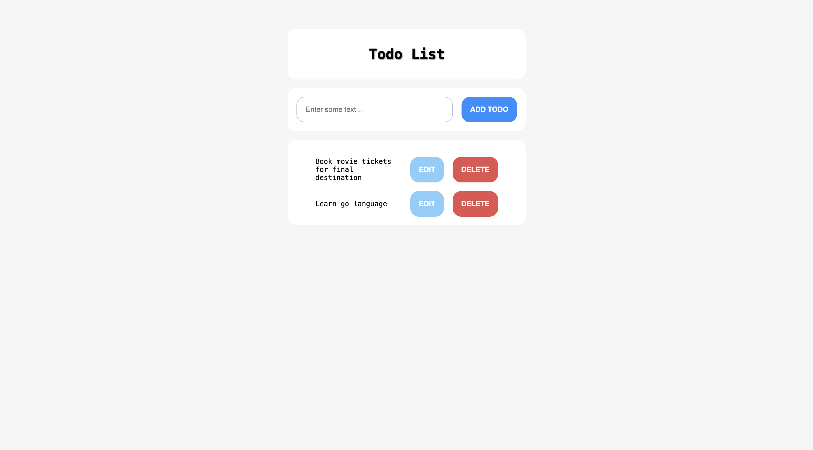

# 📝 Todo List App

## 📌 Problem Statement

Create a simple Todo list web application with the following features:
- Add, Edit, and Delete todos.
- Persist todos using `localStorage`.
- Prevent duplicate or empty entries.
- Keep UI updated after each operation.

---

## 📁 Folder Structure

├── index.html
├── index.css
└── index.js

---

## 🚀 Features

- 🧠 Smart DOM caching to avoid redundant DOM queries
- 💾 Persistent todos using `localStorage`
- 🔒 XSS-safe input rendering using `textContent`
- 🧩 Modular helper functions
- 🧪 Safe storage operations with graceful fallback
- 🎨 Clean, minimalistic design

---

## 📷 Screenshot

---

## 🧰 Tech Stack

- HTML5
- CSS3
- JavaScript (ES6)

---

## 🧪 How to Run

1. Clone the repository or download the files.
2. Open `index.html` in a browser.
3. Type a todo and click “Add Todo”.

---

## 🧑‍💻 Author

**Surya Teja Kandukuru** – Frontend Engineer
